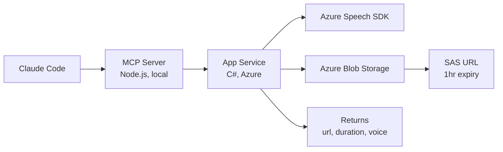

# Claude Chat Text to Speech Server

> **Azure Neural TTS as an MCP tool for Claude Code**
>
> Send text &rarr; get back a downloadable MP3 URL in seconds.



---

## What This Is

A C# ASP.NET Core minimal API running on **Azure App Service (F1 free tier)** that:

1. Accepts a POST with text + voice + format
2. Synthesizes speech via **Azure Cognitive Services Neural TTS**
3. Uploads the MP3 to **Azure Blob Storage**
4. Returns a time-limited SAS download URL

A local **MCP server** (TypeScript) wraps the HTTP call so Claude Code can use it as a native tool (`mcp__tts__synthesize_speech`).

---

## Prerequisites

- [.NET 10 SDK](https://dotnet.microsoft.com/download)
- [Node.js 18+](https://nodejs.org/)
- [Azure CLI](https://learn.microsoft.com/en-us/cli/azure/install-azure-cli)
- An Azure subscription (`az login` to authenticate)

---

## Azure Setup (PowerShell)

### 1. Set Variables

```powershell
$RG = "rg-xxx"
$LOCATION = "eastus2"
$SPEECH_NAME = "speech-xxx"
$STORAGE_NAME = "xxx"
$APP_NAME = "app-xxx"
$PLAN_NAME = "plan-xxx"
$PLAN_LOCATION = "centralus"   # F1 free tier may not be available in all regions
```

### 2. Create Resource Group

```powershell
az group create --name $RG --location $LOCATION
```

### 3. Create Speech Resource (F0 = free tier)

```powershell
az --% cognitiveservices account create --name speech-claudetts --resource-group rg-claudettsserver --kind SpeechServices --sku F0 --location eastus2 --yes
```

> **Note:** Use `az --%` (stop-parsing token) to prevent PowerShell from mangling arguments.

### 4. Create Storage Account

```powershell
az storage account create --name $STORAGE_NAME --resource-group $RG --location $LOCATION --sku Standard_LRS --kind StorageV2
```

### 5. Create App Service Plan (F1 = free tier, Linux)

```powershell
az appservice plan create --name $PLAN_NAME --resource-group $RG --location $PLAN_LOCATION --sku F1 --is-linux
```

> **Note:** F1 free tier has quota limits per region. If you get a quota error, try a different `--location` (e.g., `centralus`, `westus2`, `eastus`).

### 6. Create Web App

```powershell
az --% webapp create --name app-claudetts --resource-group rg-claudettsserver --plan plan-claudetts --runtime "DOTNETCORE:10.0"
```

### 7. Get Keys & Configure App Settings

```powershell
$SPEECH_KEY = az cognitiveservices account keys list --name $SPEECH_NAME --resource-group $RG --query key1 -o tsv
$STORAGE_CONN = az storage account show-connection-string --name $STORAGE_NAME --resource-group $RG --query connectionString -o tsv

az webapp config appsettings set --name $APP_NAME --resource-group $RG --settings AZURE_SPEECH_KEY="$SPEECH_KEY" AZURE_SPEECH_REGION="$LOCATION" AZURE_STORAGE_CONNECTION_STRING="$STORAGE_CONN"
```

> **If `az webapp config appsettings set` fails** with a version error (known Azure CLI bug on PowerShell), use the REST API instead:
>
> ```powershell
> # 1. List current settings
> az --% rest --method POST --uri "/subscriptions/<SUB_ID>/resourceGroups/rg-claudettsserver/providers/Microsoft.Web/sites/app-claudetts/config/appsettings/list?api-version=2023-12-01" -o json > current_settings.json
>
> # 2. PUT all settings (existing + custom) via REST
> az --% rest --method PUT --uri "/subscriptions/<SUB_ID>/resourceGroups/rg-claudettsserver/providers/Microsoft.Web/sites/app-claudetts/config/appsettings?api-version=2023-12-01" --body "{\"properties\":{...merge existing + your 3 keys...}}"
> ```

### 8. Deploy

```powershell
cd C:\Dev\ClaudeChatTTSServer
dotnet publish -c Release -o ./publish
Compress-Archive -Path ./publish/* -DestinationPath ./deploy.zip -Force
az webapp deploy --name $APP_NAME --resource-group $RG --src-path ./deploy.zip --type zip
```

### 9. Test

```powershell
# Health check
Invoke-WebRequest -Uri "https://app-claudetts.azurewebsites.net/"

# Synthesize speech
Invoke-WebRequest -Uri "https://app-claudetts.azurewebsites.net/api/tts" -Method POST -ContentType "application/json" -Body '{"text":"Hello, this is a test."}'
```

---

## MCP Server Setup (Claude Code Integration)

### 1. Build the MCP Server

```powershell
cd C:\Dev\ClaudeChatTTSServer\mcp-server
npm install
npm run build
```

### 2. Add to Claude Code (Global)

Copy `.mcp.json` to your home directory so the TTS tool is available in **every** Claude Code project:

```powershell
Copy-Item C:\Dev\ClaudeChatTTSServer\.mcp.json C:\Users\<YOUR_USERNAME>\.mcp.json
```

Or to `~/.claude/.mcp.json` if the home root doesn't work.

### 3. Restart Claude Code

Fully quit and reopen Claude Code. You should see `tts` in the MCP server list.

### 4. Use It

Just ask Claude:

> "Generate audio for: Welcome to the show, folks!"

Claude will call `mcp__tts__synthesize_speech` and return a downloadable MP3 URL.

---

## API Reference

### `POST /api/tts`

| Field    | Type   | Default                              | Description                    |
|----------|--------|--------------------------------------|--------------------------------|
| `text`   | string | **(required)**                       | Text to synthesize (max 100K chars) |
| `voice`  | string | `en-US-AriaNeural`                   | Azure Neural TTS voice name    |
| `format` | string | `audio-16khz-128kbitrate-mono-mp3`   | Output audio format            |

**Response:**
```json
{
  "url": "https://stclaudetts.blob.core.windows.net/tts-audio/abc123.mp3?sv=...",
  "durationSeconds": 3.2,
  "voice": "en-US-AriaNeural",
  "characterCount": 42
}
```

### `GET /`

Health check. Returns `{"status":"healthy","service":"ClaudeChatTTSServer"}`.

---

## Popular Voices

| Voice | Gender | Style |
|-------|--------|-------|
| `en-US-AriaNeural` | Female | Conversational (default) |
| `en-US-GuyNeural` | Male | Conversational |
| `en-US-JennyNeural` | Female | Warm |
| `en-US-DavisNeural` | Male | Calm |
| `en-US-SaraNeural` | Female | Cheerful |
| `en-US-TonyNeural` | Male | Friendly |
| `en-US-NancyNeural` | Female | Empathetic |
| `en-GB-SoniaNeural` | Female | British |
| `en-GB-RyanNeural` | Male | British |
| `en-US-AvaMultilingualNeural` | Female | Multilingual |
| `en-US-AndrewMultilingualNeural` | Male | Multilingual |

[Full voice list](https://learn.microsoft.com/en-us/azure/ai-services/speech-service/language-support?tabs=tts)

---

## Audio Formats

| Format | Quality | Use Case |
|--------|---------|----------|
| `audio-16khz-128kbitrate-mono-mp3` | Good | Default, small file size |
| `audio-24khz-160kbitrate-mono-mp3` | Better | Higher quality |
| `audio-48khz-192kbitrate-mono-mp3` | Best | Studio quality |

---

## Running Tests

### C# (xUnit)

```powershell
dotnet test
```

Runs 21 tests covering API endpoint validation, service error handling, format parsing, and model defaults. Uses `WebApplicationFactory` with mocked dependencies — no Azure credentials needed.

### TypeScript (Vitest)

```powershell
cd mcp-server
npm test
```

Runs 8 tests covering the `synthesizeSpeech` function: request formatting, success/error responses, default parameters, and network error handling.

---

## Project Structure

```
ClaudeChatTTSServer/
  Program.cs                  # Minimal API entry point
  Models/
    TtsRequest.cs             # Input model
    TtsResponse.cs            # Output model
  Services/
    ITtsService.cs            # Service interface
    TtsService.cs             # Speech synthesis + blob upload
  ClaudeChatTTSServer.Tests/
    ApiIntegrationTests.cs    # API endpoint integration tests (xUnit)
    TtsServiceTests.cs        # Format parsing unit tests
    ModelTests.cs             # Model default/property tests
  mcp-server/
    src/index.ts              # MCP tool wrapper (TypeScript)
    src/synthesize.ts         # Extracted synthesis logic
    src/synthesize.test.ts    # Vitest tests
    dist/index.js             # Built output (run npm run build)
  .mcp.json                   # MCP config for Claude Code
  appsettings.json            # Local config (keys go in Azure app settings)
```

---

## Cost

| Resource | Tier | Cost |
|----------|------|------|
| App Service | F1 (free) | $0/month |
| Speech Services | F0 (free) | 500K chars/month free |
| Blob Storage | Standard LRS | ~$0.02/GB/month |

For occasional Claude-driven TTS, total cost is effectively **$0/month**.

---

## Rotate Keys

If you exposed keys during setup (e.g., pasted them in chat), rotate them:

```powershell
# Regenerate Speech key
az cognitiveservices account keys regenerate --name speech-claudetts --resource-group rg-claudettsserver --key-name key1

# Regenerate Storage key
az storage account keys renew --account-name stclaudetts --resource-group rg-claudettsserver --key primary

# Get new values and update app settings
$SPEECH_KEY = az cognitiveservices account keys list --name speech-claudetts --resource-group rg-claudettsserver --query key1 -o tsv
$STORAGE_CONN = az storage account show-connection-string --name stclaudetts --resource-group rg-claudettsserver --query connectionString -o tsv

az webapp config appsettings set --name app-claudetts --resource-group rg-claudettsserver --settings AZURE_SPEECH_KEY="$SPEECH_KEY" AZURE_STORAGE_CONNECTION_STRING="$STORAGE_CONN"
```
